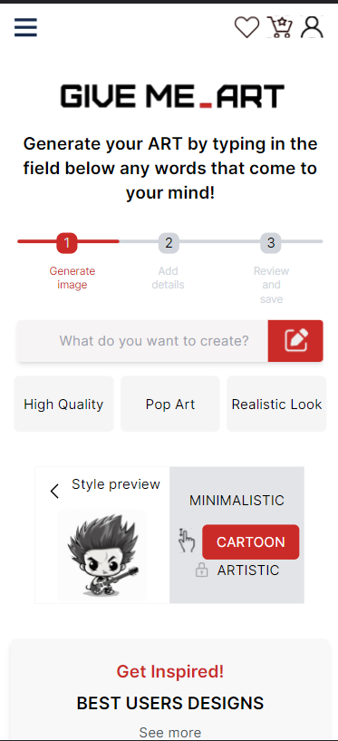

# Generate-Art in Next. js 13 using Tailwind CSS



## Getting Started

### Wymagania systemowe:

Before you start working with the project, make sure that the following tools are installed on your computer:

- Node.js
- npm

# Instalation

- Clone or download this repository to a selected location on your computer.
- Open the terminal and go to the project directory.

```bash
cd sciezka/do/projektu/generate-art
```

- Install project dependencies using npm:

```bash
npm install
```

### Launching the project

- Once the dependencies are installed, you can run the project in the development environment. In the terminal, run the following command:

```bash
npm run dev
```

- The application will be launched on a local server and will be available in your browser at http://localhost:3000.

# Struktura projektu

- Components directory contains reusable UI components.
- Pages directory contains files that are mapped to application paths. The page. tsx file is the main page.
- The assets directory contains static assets such as images.
